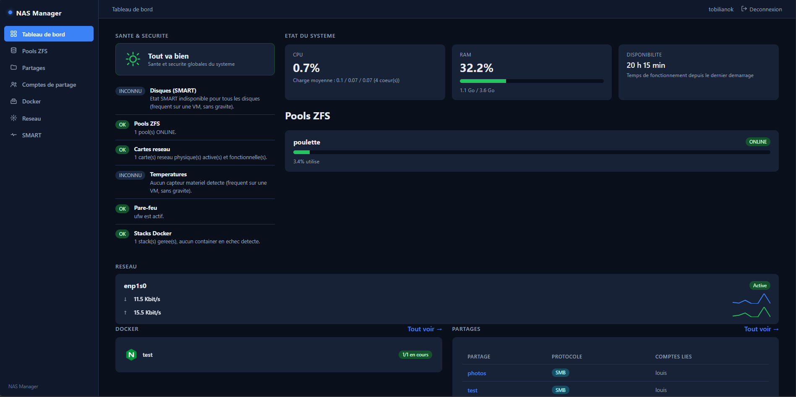

# NAS Manager

Interface web de gestion NAS pour Ubuntu Server 26.04 LTS, basée sur ZFS.

**Version actuelle : v1.2.0** — voir [CHANGELOG.md](CHANGELOG.md). Le numéro
est affiché en bas du menu latéral ; le survol donne le commit déployé et
signale si des fichiers ont été modifiés à la main sur le serveur.

## État du projet

- Phase 0 : fondations (auth PAM, service systemd) — validé en conditions réelles.
- Phase 1 : détection et protection des disques système — validé en conditions réelles.
- Phase 2 : gestion des pools ZFS (création, cache L2ARC/SLOG/Special VDEV avec
  pédagogie, suppression) — validé en conditions réelles.
- Phase 3 : tableau de bord système (CPU/RAM/uptime en direct), état SMART des
  disques, remplacement guidé de disque en cas de panne (mise hors ligne,
  instructions physiques, suivi du resilver) — livré, en attente de test réel.
- Phase 4 : dossiers partagés SMB/NFS (chaque partage = un dataset ZFS dédié),
  comptes de partage dédiés (sans accès SSH ni à l'interface d'admin),
  permissions lecture/écriture ou lecture seule par utilisateur, export NFS
  restreint par plage IP — validé en conditions réelles (SMB confirmé ; NFS
  et permissions ro/rw pas encore testés spécifiquement).
- Phase 5 : gestion complète des stacks Docker Compose (chaque stack = un
  dataset ZFS dédié pour la config ET les volumes en bind-mount), création
  depuis un docker-compose.yml collé directement, démarrage/arrêt/redémarrage,
  édition de la configuration à chaud, vérification des mises à jour d'image
  par comparaison de digest (sans jamais télécharger tant que ce n'est pas
  demandé explicitement), consultation des journaux par service, suppression
  sans aucune trace résiduelle (down -v + destruction du dataset) — validé en
  conditions réelles.
- Phase 6 : refonte graphique complète (layout commun avec menu latéral façon
  TrueNAS/Unraid, une seule feuille de style partagée par toutes les pages au
  lieu de CSS dupliqué par template), HTTPS par défaut (certificat auto-signé
  généré automatiquement, port 8443), pare-feu `ufw` configuré automatiquement
  (seuls les ports nécessaires sont ouverts) — en usage réel (Louis a vu et
  commenté le nouveau tableau de bord via l'interface HTTPS), sans
  confirmation explicite spécifique sur le pare-feu ufw à ce stade.
- Phase 7a : tableau de bord enrichi — mise en page élargie (occupe mieux
  l'écran), widget réseau (débit descendant/montant en direct par carte
  physique, détection de carte hors service), météo de santé/sécurité
  globale (disques SMART, pools ZFS, réseau, températures via lm-sensors,
  pare-feu, Docker, politique de mot de passe), récapitulatifs Docker et
  Partages directement sur l'accueil, icônes personnalisées par stack Docker
  (upload PNG/SVG/JPEG/WebP), politique de mot de passe complexe avec
  confirmation pour les comptes de partage, et clarification de la section
  cache (L2ARC/SLOG/Special VDEV) à la création d'un pool — livré, en
  attente de test réel.
- Phase 7b : nouveau menu "Réseau" complet — configuration IP par carte
  (DHCP ou adresse fixe), DNS, agrégats de liens (bonding actif-passif ou
  LACP) pour les serveurs à plusieurs cartes, et gestion du wifi (scan +
  WPA2) si une carte wifi est détectée ; toute application passe par un
  récapitulatif puis par `netplan try` (mécanisme natif Ubuntu) — le
  changement est actif immédiatement mais annulé automatiquement s'il n'est
  pas confirmé sous ~90s, exactement comme sur un routeur grand public,
  pour ne jamais pouvoir rester bloqué dehors durablement par une mauvaise
  IP ou un DNS cassé. Console Docker interactive (`docker exec` façon
  Portainer, une session shell persistante par service en cours
  d'exécution, pilotée via WebSocket) accessible directement depuis le
  détail d'une stack — livré, en attente de test réel. Ces deux
  fonctionnalités étaient volontairement exclues de la Phase 7a vu leur
  sensibilité (risque de coupure d'accès au NAS pour le réseau).

- Phase 8a : retrait de la verification "politique de mot de passe" de la
  météo de santé (impossible d'evaluer la robustesse d'un mot de passe deja
  enregistre - la case verte permanente induisait en erreur), icone de
  stack Docker selectionnable des la creation (en plus de l'ajout/
  changement apres coup), favicon, et refonte complete des comptes de
  partage : creation et changement de mot de passe via des fenetres
  modales (au lieu de champs inline), profils enrichis (prenom/nom via le
  champ GECOS, avatar photo ou emoji), et partages desormais assignables a
  un groupe Linux entier en plus des utilisateurs individuels (permissions
  SMB `@groupe` + ACL POSIX de groupe) — livré, en attente de test réel.
  La création de groupes (y compris `nasadmin`) et la gestion des comptes
  système/sudo restent volontairement hors perimetre de cette phase,
  reportées a une phase dédiée avec des garde-fous stricts (impossible de
  se retirer soi-même l'accès admin ou de supprimer le dernier compte
  admin+sudo).
- Phase 8b : nouvelle page "Comptes système" — gestion des VRAIS comptes
  systeme Linux (avec shell et repertoire personnel, du type cree a
  l'installation d'Ubuntu), distincte des comptes de partage (Phase 8a) :
  creation, profil (nom complet, groupes supplementaires), changement de mot
  de passe, verrouillage/deverrouillage, octroi/retrait du sudo, octroi/
  retrait de l'acces a cette interface (groupe `nasadmin`), suppression avec
  confirmation par re-saisie du nom du compte. Gestion des groupes Linux
  (creation, suppression, liste des membres) avec `nasadmin`/`nasshares`/
  `sudo` protegés en permanence. Garde-fous stricts, verifies cote serveur a
  chaque appel : impossible de se retirer a soi-meme le sudo ou l'acces
  admin, impossible de supprimer son propre compte, impossible de faire
  tomber a zero le nombre de comptes ayant a la fois sudo ET l'acces admin
  (dernier "compte de secours"), et toute action sensible (retrait sudo,
  retrait acces admin, suppression de compte) exige de re-saisir son PROPRE
  mot de passe (celui de la session en cours, verifie via PAM) — jamais celui
  du compte cible — livré, en attente de test réel.
- Phase 8c : stockage Docker. Correctif de la cause racine des "datasets
  orphelins" : quand la création d'une stack échoue (compose invalide, port
  déjà pris…), le dataset créé pour l'occasion est désormais nettoyé
  automatiquement (`down -v` puis destruction), donc le nom reste
  réutilisable ; et si un dataset préexiste déjà sans stack enregistrée, la
  création refuse explicitement en pointant vers la page de nettoyage
  plutôt que d'échouer avec un message cryptique. Nouvelle page
  Docker → "Stockage & arborescence" : inventaire lu en direct de tout ce
  qui vit sous `<pool>/docker` (datasets ZFS, simples dossiers, tailles),
  arborescence dépliable par stack, classement stack enregistrée / orphelin
  / stack fantôme (enregistrée mais dataset disparu), suppression des
  orphelins avec confirmation par re-saisie du nom (revérification serveur
  que la cible est bien un orphelin confiné sous `<pool>/docker`, jamais une
  stack enregistrée) et retrait du registre des fantômes. Bandeau d'alerte
  sur la liste des stacks quand des orphelins existent — livré, en attente
  de test réel.
- Phase 9a : correction du graphe de débit réseau (il restait figé à 90 px
  collé à droite au lieu d'occuper la largeur de la carte ; les deux
  courbes descendant/montant sont désormais alignées sur la même colonne),
  et surtout **actions Docker avec logs en direct** : boutons
  `⬇ Pull` (`docker compose pull`) et `▲ Up -d` (`docker compose up -d`)
  sur le détail d'une stack, qui ouvrent une fenêtre affichant la sortie de
  Docker ligne par ligne pendant l'exécution (WebSocket, même mécanisme que
  la console interactive). La fenêtre se ferme toute seule 3 s après un
  succès et rafraîchit l'état des containers ; en cas d'échec elle reste
  ouverte avec le code de sortie, les logs complets et un bouton « Copier
  les logs ». La fermeture est bloquée pendant l'exécution (ni clic
  extérieur ni Échap) pour ne jamais couper une commande en cours. Les
  actions existantes (démarrer / arrêter / redémarrer / mettre à jour)
  passent par la même fenêtre au lieu d'être muettes. Les commandes
  exécutables sont une liste blanche côté serveur (`app/dockerops.py`) :
  le navigateur envoie une clé d'action, jamais une commande — livré, en
  attente de test réel.
- Phase 9b : un compte de partage peut désormais recevoir l'accès admin à
  l'interface (groupe `nasadmin`), avec des garde-fous. C'est une action
  dédiée, jamais un effet de bord d'une modification de profil : une
  fenêtre explique que le compte pourra TOUT administrer (le shell
  `nologin` n'empêche pas l'authentification PAM du site) et rappelle qu'un
  mot de passe de partage circule plus facilement qu'un mot de passe
  d'administration, puis exige de re-saisir le mot de passe de l'admin
  connecté (vérifié via PAM), jamais celui du compte cible. Impossible de
  retirer l'accès admin de son propre compte connecté. Les comptes
  concernés portent un badge « ⚠ Accès admin » dans la liste, et une
  nouvelle vérification de la météo de santé les signale sur le tableau de
  bord. Corrige au passage un effet de bord : modifier le profil d'un
  compte (`usermod -G` remplace tous les groupes secondaires) retirait
  silencieusement son appartenance à `nasadmin` — livré, en attente de test
  réel.
- Phase 9c : nouveau menu « Sauvegarde » — export et restauration de la
  configuration, sous forme d'une **archive `.tar.gz` téléchargée** (rien
  n'est conservé sur le NAS : une sauvegarde qui ne vit que sur la machine
  à restaurer ne sert à rien le jour où elle ne démarre plus). L'archive
  contient les registres NAS Manager (partages, stacks, icônes, avatars),
  les comptes de partage et système avec leurs groupes et les
  **empreintes** de leurs mots de passe (système + base Samba), la
  configuration générée (`smb.conf`, `/etc/exports`, netplan), le
  `docker-compose.yml` de chaque stack et la topologie ZFS en
  documentation ; jamais le `.env` (secret vivant) ni les données des
  partages/volumes (rôle des snapshots ZFS). La restauration passe par un
  **aperçu** de ce que contient l'archive avant toute écriture, avec choix
  des sections et re-saisie du mot de passe de l'admin connecté ; elle ne
  supprime jamais rien (crée ce qui manque, complète ce qui existe,
  `usermod -aG` et non `-G`). `smb.conf` et `/etc/exports` sont régénérés
  depuis le registre restauré (bloc géré uniquement) plutôt qu'écrasés. La
  configuration réseau et la topologie ZFS sont archivées et affichées mais
  **jamais rejouées** (se verrouiller dehors, détruire des disques) ; les
  stacks sont recréées mais pas démarrées. Extraction protégée contre les
  chemins absolus, les `..`, les liens symboliques et les archives
  anormalement volumineuses — livré, en attente de test réel.
- Phase 10 : agrandissement d'un pool ZFS existant, sans perte de données.
  Deux opérations, et deux seulement : **élargir un groupe RAIDZ** en lui
  ajoutant UN disque (`zpool attach`, extension RAIDZ d'OpenZFS 2.3+ — le
  pool reste utilisable pendant toute l'opération, et ZFS reprend où il en
  était après un redémarrage), ou **ajouter un groupe complet** au pool
  (`zpool add mirror|raidzN ...`, seul moyen d'agrandir un pool en miroir,
  qui ne grandit pas en recevant un disque de plus). Ce qui n'est **jamais**
  proposé : ajouter un disque nu à un pool redondant — `zpool add tank
  /dev/sdX` fonctionne et crée une grappe sans redondance dont la perte
  emporterait tout le pool ; le module refuse catégoriquement tout groupe
  moins redondant que l'existant, et aucune commande n'utilise `-f`.
  Vérifications avant d'agir : pool sain uniquement (jamais pendant un
  resilver ni une autre extension), disques revalidés en direct (jamais
  un disque système ni déjà membre d'un pool), taille comparée à celle des
  disques en place, essai à blanc `zpool -n` quand la version le permet
  (et signalé honnêtement quand elle ne le permet pas), puis recalcul
  complet du plan au moment du clic. L'interface dit avant, pas après, que
  les données déjà écrites conservent leur ancien ratio de parité :
  l'espace utile se libère progressivement. Suivi de progression en direct
  sur la page du pool, et bouton de `zpool upgrade` (avec re-saisie du nom)
  quand la fonctionnalité `raidz_expansion` dort sur un pool créé avant —
  livré, en attente de test réel.
- Phase 10a : refonte du widget réseau du tableau de bord. La correction de
  la 9a avait remplacé un défaut par un autre — les courbes occupaient enfin
  toute la largeur, mais deux traits de 24 px étirés sur 1200 px donnent un
  rapport de 40:1 qui écrase complètement le signal. Les deux traits sont
  remplacés par **un seul graphique par carte** (~104 px de haut), avec les
  courbes descendante et montante superposées **à échelle verticale
  commune** — sans ça, chacune normalisée sur son propre maximum, une carte
  à 2 Kbit/s et une à 200 Kbit/s auraient exactement la même allure et la
  comparaison serait mensongère. Aplat translucide sous chaque courbe pour
  percevoir le volume d'un coup d'œil, épaisseur de trait constante malgré
  l'étirement horizontal (`vector-effect="non-scaling-stroke"`), et le pic
  de la période affiché en clair dans le coin — livré, en attente de test
  réel.
- Phase 10b : correction d'un bug rencontré en usage réel. Supprimer un pool
  laissait derrière lui les partages et les stacks qui vivaient dessus :
  entrées mortes dans les registres, partages toujours déclarés dans
  `smb.conf` en pointant vers un chemin inexistant — et **impossibles à
  supprimer**, `delete_share` échouant sur « le dataset n'existe pas ».
  Trois correctifs : (1) supprimer un partage fonctionne désormais même si
  son dataset a déjà disparu (un nettoyage ne doit jamais être bloqué parce
  que ce qu'on nettoie n'est plus là) ; (2) supprimer un pool arrête d'abord
  les stacks qui s'y trouvent — pendant que leur `docker-compose.yml` est
  encore lisible et les bind-mounts encore montés, sinon `down -v` ne
  nettoierait plus rien — détruit le pool, puis seulement ensuite retire
  partages et stacks des registres et régénère `smb.conf`/`exports` (dans
  cet ordre : si la destruction échoue, aucune définition n'est perdue) ;
  (3) la page de confirmation liste **avant** ce qui sera emporté, et la
  liste des partages signale d'un badge ceux dont le dataset a disparu —
  livré, en attente de test réel.
- Phase 10c : refonte du panneau « État du système » du tableau de bord.
  Le CPU affiche désormais son **modèle**, sa **fréquence** courante (lue
  via `cpufreq`, avec le maximum matériel en repère), le nombre de cœurs
  physiques **et** de threads, et surtout une **barre par cœur logique** :
  une charge de 40 % répartie sur seize cœurs et un seul cœur à 100 % ne
  décrivent pas du tout la même machine, or un pourcentage global les
  confond. La RAM passe d'une barre unique à une **barre à trois segments**
  (programmes / cache / libre) : le cache n'est pas de la mémoire perdue,
  il est rendu instantanément dès qu'un programme en a besoin — l'afficher
  à part évite de croire à tort que la machine sature, ce qui arrive vite
  sur un serveur ZFS où l'ARC occupe volontiers la moitié de la RAM. Le
  swap, la charge moyenne et l'heure de démarrage complètent le tableau,
  avec un repère de saturation quand la charge dépasse le nombre de
  threads. Enfin le **graphique réseau est rapatrié dans le panneau**,
  entre RAM et Disponibilité : il ne vit plus dans son propre bloc HTMX,
  donc tout le panneau se rafraîchit d'un seul coup au même rythme au lieu
  de deux cycles indépendants — livré, en attente de test réel.
- Phase 11a : réorganisation du menu latéral et numérotation des versions.
  Dix entrées à plat, ça se cherche : le menu est désormais structuré en
  rubriques repliables — **Stockage** (Pools ZFS, Partages, SMART),
  **Comptes** (comptes de partage, comptes système) et **Paramètres**
  (Réseau, Sauvegarde) — Tableau de bord et Docker restant au premier niveau
  puisqu'on y va tous les jours. La structure est décrite une seule fois dans
  `app/navigation.py` au lieu d'être écrite à la main dans le gabarit commun :
  la règle qui allume l'entrée courante existait auparavant en dix copies,
  donc n'était testée nulle part (et `/shares` vs `/share-users` est
  exactement le genre de piège qu'elle cache). Les rubriques sont des
  `<details>` ouverts **par le serveur** : celle de la page affichée est
  déjà ouverte au premier pixel, et le menu reste utilisable même si le
  JavaScript ne charge pas. Le projet passe en **v1.0.0** (versionnage
  sémantique, `CHANGELOG.md`), numéro affiché en bas du menu — c'est la
  référence sur laquelle s'appuie l'écran de mise à jour de la 11b.
- Phase 11b (**v1.1.0**) : nouveau menu « Mises à jour », deux systèmes
  indépendants. Côté **Ubuntu** : état lu sans rien modifier, puis quatre
  actions diffusées en direct — mise à jour simple (qui n'enlève jamais un
  paquet), sécurité uniquement, nettoyage, et `dist-upgrade` **précédé d'une
  page listant les paquets qui seraient supprimés**, recalculée au clic ; si
  cette liste ne peut pas être calculée, le bouton disparaît, parce qu'on ne
  lance pas à l'aveugle une commande capable de retirer ZFS ou Samba. Toutes
  les commandes sont non interactives : sans ça une question d'apt sur un
  fichier de configuration bloquerait le processus indéfiniment, sans clavier
  pour répondre. Redémarrage de la machine protégé par un mot à retaper *et*
  le mot de passe admin, avec avertissement si un resilver tourne ou si des
  stacks sont en cours. Côté **NAS Manager** : mise à jour depuis GitHub vers
  le dernier tag (stable) ou le dernier commit de `main` (développement,
  averti), avec **retour arrière automatique** si l'interface ne répond plus
  après redémarrage — une interface qui se met à jour elle-même peut se
  couper l'accès, et sans ce filet il faudrait du SSH pour s'en sortir. Le
  travail est confié à un script détaché (`systemd-run`) : le processus qui
  redémarre le service ne peut pas être celui qu'on redémarre. Les données
  (`/var/lib/nas-manager`) sont hors du code mis à jour, donc jamais
  concernées — livré, en attente de test réel.
- Phase 11c (**v1.2.0**) : correction d'un blocage rencontré dès la première
  utilisation — `fatal: could not read Username for 'https://github.com'`. Le
  dépôt est privé et le service tourne en `root`, alors que les identifiants
  git appartiennent au compte administrateur : `git fetch` demandait un login
  sur un terminal qui n'existe pas. Les appels git interdisent désormais toute
  invite (`GIT_TERMINAL_PROMPT=0`) et **l'échec est traduit en explication
  actionnable** — différente selon qu'aucun jeton n'est enregistré, qu'un jeton
  est refusé, ou que le dépôt est en SSH (c'est alors la clé de root qui est en
  jeu, pas un jeton). Nouvelle section « Accès à GitHub » : saisie d'un jeton
  d'accès personnel, vérification immédiate auprès de GitHub à
  l'enregistrement, bouton de test (`git ls-remote`, qui ne modifie rien),
  suppression — le tout protégé par le mot de passe admin. Le jeton est créé
  directement en 0600, n'est jamais inscrit dans l'URL du dépôt (elle
  apparaîtrait dans `git remote -v` et dans les messages d'erreur), jamais
  passé en argument (il serait visible dans `ps`), jamais réaffiché en clair,
  et n'entre pas dans les sauvegardes de configuration — livré, en attente de
  test réel.

Voir la feuille de route complète dans le projet Claude ("Création OS pour NAS"
→ doc `roadmap.md`).

## Stack

- Backend : Python 3 / FastAPI / Uvicorn
- Frontend : Jinja2 + HTMX + Alpine.js (via CDN, pas de build JS)
- Auth : comptes systèmes Linux (PAM)
- Le service tourne en **root** (obligatoire pour piloter `zpool`, `parted`,
  `smartctl`, `systemctl`, Docker, Samba/NFS).
- Docker : installé automatiquement par `install.sh` (Docker Engine + plugin
  `compose` + `buildx`) via le script officiel `get.docker.com`.
- CSS : une seule feuille de style partagée (`app/static/css/style.css`),
  chargée par toutes les pages via un layout Jinja2 commun (`base.html`) —
  plus de style dupliqué par template.
- Réseau : lecture directe de `/proc/net/dev` et `/sys/class/net/` (aucune
  dépendance externe type psutil/ifstat) pour le débit et l'état des cartes
  physiques.
- Températures : lues via `lm-sensors` (`sensors -j`), installé et détecté
  automatiquement par `install.sh` (`sensors-detect --auto`) ; dégrade
  proprement en "inconnu" si aucun capteur n'est trouvé (fréquent en VM).
- Configuration réseau : gérée via `netplan` (moteur standard d'Ubuntu
  Server), un seul fichier dédié (`/etc/netplan/90-nas-manager.yaml`) qui
  sert lui-même de source de vérité (pas de registre JSON dupliqué à tenir
  synchronisé). Toute application passe par une double sécurité : (1) un
  essai à blanc réel (`netplan generate --root-dir <temp>`, jamais sur le
  système réel) avant toute écriture définitive, puis (2) `netplan try`
  (mécanisme natif, pas une réimplémentation maison) qui applique le
  changement immédiatement et le révoque tout seul si personne ne confirme
  dans le délai imparti. Wifi : scan best-effort via `iw`, connexion WPA2
  via `wpasupplicant` (les deux installés par `install.sh`).
- Console Docker interactive : session shell persistante par container
  (`docker exec -i <container> sh`), relayée en direct via WebSocket
  (pas de pseudo-terminal complet ni de dépendance JS externe type
  xterm.js — un simple flux ligne par ligne suffit pour l'usage visé).

## Installation

```bash
git clone <URL_DU_DEPOT> /opt/nas-manager
cd /opt/nas-manager
sudo ./install.sh
```

Le script est idempotent : il peut être relancé sans risque après un `git pull`
pour mettre à jour l'installation. À la fin, l'interface est accessible en
HTTPS sur `https://<ip-du-nas>:8443` (voir section HTTPS ci-dessous).

## Sécurité — HTTPS

`install.sh` génère automatiquement un certificat auto-signé (valide 10 ans,
dans `/etc/nas-manager/ssl/`) et sert l'interface exclusivement en HTTPS sur
le port **8443** (jamais en clair). Ton navigateur affichera un avertissement
« connexion non sécurisée » à la première visite : c'est normal pour un
certificat auto-signé sur un réseau local, il suffit de l'accepter une fois
(l'empreinte ne change plus ensuite, tant que le certificat n'est pas
régénéré). Le cookie de session est marqué `Secure` dès que `install.sh` a
tourné (`SESSION_HTTPS_ONLY=true` dans `.env`), donc jamais transmis en clair.

Pour utiliser un certificat existant (délivré par ton routeur, pfSense, ou
une autre autorité interne) à la place de celui généré automatiquement,
remplace `/etc/nas-manager/ssl/privkey.pem` et `/etc/nas-manager/ssl/cert.pem`
puis relance `sudo systemctl restart nas-manager.service` (`install.sh` ne
régénère jamais un certificat déjà présent).

## Sécurité — pare-feu (ufw)

`install.sh` active `ufw` et n'ouvre que les ports strictement nécessaires :
l'interface NAS Manager (8443/tcp), SSH (22/tcp), Samba (445/tcp, 139/tcp,
137-138/udp) et NFS (2049/tcp, 111/tcp+udp). Tout le reste est bloqué en
entrée par défaut.

**Limite importante à connaître** : Docker gère ses propres règles `iptables`
et contourne `ufw` par défaut — un port publié par une stack Docker Compose
(ex. `"8081:80"` dans un `docker-compose.yml`) reste donc joignable depuis le
réseau même si `ufw` est actif, quelle que soit la règle `ufw` configurée.
Si tu dois restreindre l'accès réseau à une stack précise, fais-le au niveau
du routeur/pare-feu périmétrique, ou renseigne-toi sur `ufw-docker`.

## Sécurité — disques protégés

Le système Ubuntu (RAID1, LVM, ou toute combinaison) ne doit **jamais** être
modifiable par cette interface. Le module `app/disks.py` parcourt
l'arborescence complète `lsblk` (partitions, RAID logiciel, LVM imbriqués...)
et marque protégé tout disque physique portant, de près ou de loin, un bout
du système actuellement démarré — quelle que soit la technologie sous-jacente.
Cette liste n'est jamais éditable depuis l'interface web.

## Tests automatisés

```bash
python3 -m venv venv
source venv/bin/activate
pip install -r requirements-dev.txt
pytest tests/ -v
```

Optionnel (pas nécessaire pour faire tourner NAS Manager), mais recommandé
avant de valider une mise à jour manuellement modifiée : la suite couvre la
détection des disques, la validation des pools ZFS, le remplacement de
disque, la lecture SMART, les partages SMB/NFS (utilisateurs ET groupes),
les comptes de partage (profil, avatar), les comptes système/sudo et les
groupes Linux (garde-fous d'auto-verrouillage inclus), les stacks Docker
Compose (y compris le nettoyage automatique en cas d'échec de création), l'état réseau, la météo de santé/sécurité, la configuration réseau
(netplan, agrégats, wifi, application avec confirmation/retour arrière),
la console Docker interactive, le stockage Docker (orphelins, arborescence),
les actions Docker diffusées en direct (liste blanche, étapes, codes de
sortie), l'accès admin des comptes de partage (garde-fous, reconfirmation
de mot de passe), la sauvegarde/restauration de configuration (contenu de
l'archive, refus des archives piégées, restauration sélective) et les
routes web, et l'agrandissement de pool (refus des configurations qui
affaibliraient la redondance, essai à blanc, recalcul avant exécution),
la cascade de suppression d'un pool (ordre des opérations, registres
préservés si la destruction échoue), le panneau d'état système enrichi
(charge par cœur, topologie CPU, répartition mémoire) et la structure du
menu latéral (correspondance page/entrée, rubriques, version affichée), les
mises à jour système (analyse des simulations apt, liste blanche d'actions
non interactives, redémarrage requis) et la mise à jour de NAS Manager
lui-même (garde-fous avant lancement, détachement du processus, fichier
d'état, retour arrière) et l'accès GitHub (traitement du jeton, diagnostic des
échecs d'authentification, absence du secret dans les sauvegardes) (716 tests).

## Développement

```bash
python3 -m venv venv
source venv/bin/activate
pip install -r requirements.txt
sudo venv/bin/uvicorn app.main:app --host 0.0.0.0 --port 8080 --reload
```

(Le `sudo` est nécessaire même en dev car `disks.py` appelle des commandes
système privilégiées. En dev, l'interface reste volontairement en HTTP simple
sur le port 8080 - sans `--ssl-keyfile`/`--ssl-certfile` ni `SESSION_HTTPS_ONLY`
dans l'environnement. C'est uniquement `install.sh` qui bascule en HTTPS sur
le port 8443 pour un déploiement réel.)
